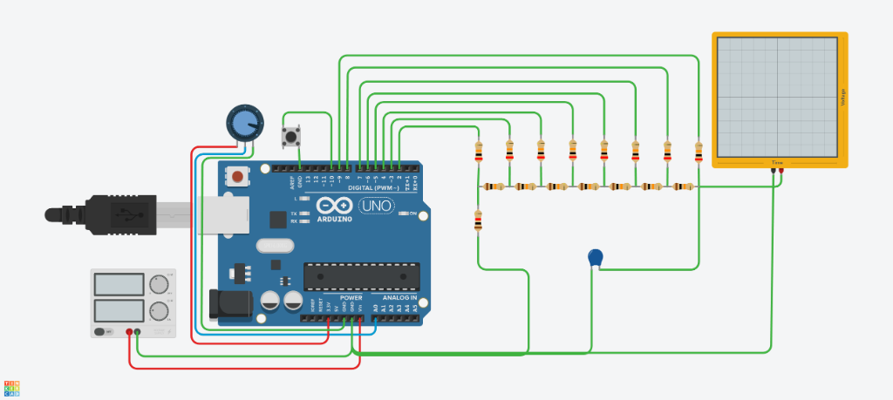

# 8-Bit Arduino Function Generator

A simple yet effective function generator built using an Arduino and an 8-bit R-2R Resistor Ladder DAC. It generates Sine, Triangle, and Sawtooth waveforms with variable frequency.

## Features

- **3 Waveforms**: Sine, Triangle, Sawtooth.
- **8-Bit Resolution**: Uses an R-2R ladder on digital pins D2-D9.
- **Variable Frequency**: Controlled via a potentiometer on pin A0.
- **Mode Switching**: Pushbutton on pin D10 cycles through waveforms.

## Hardware Requirements

| Component | Quantity | Notes |
| :--- | :---: | :--- |
| Arduino (Uno, Nano, etc.) | 1 | 5V logic recommended |
| Resistors (10kΩ & 20kΩ) | Many | For R-2R Ladder (or pre-made DAC module) |
| Capacitor (0.01uF) | 1 | Output filtering or power decoupling |
| Potentiometer (10kΩ-100kΩ) | 1 | For frequency control |
| Pushbutton | 1 | For mode switching |
| Breadboard & Jumpers | - | - |

## Pinout Configuration

| Arduino Pin | Function | Description |
| :--- | :--- | :--- |
| **D2 - D9** | DAC Switch (Output) | **D2 = LSB**, **D9 = MSB**. Connect to R-2R Ladder. |
| **D10** | Mode Button (Input) | Connect to Button, then to GND. (Uses Internal Pullup). |
| **A0** | Rate Control (Input) | Center pin of Potentiometer. Side pins to 5V and GND. |

### Wiring Diagram

### R-2R DAC Wiring

Connect the R-2R ladder to pins D2 through D9. 
- **D2** is the Least Significant Bit (LSB).
- **D9** is the Most Significant Bit (MSB).

## Usage

1.  **Build the Circuit**: Assemble the R-2R ladder and connect the controls as per the pinout.
2.  **Upload Code**: Open `ArduinoFuncGen.ino` in the Arduino IDE and upload it to your board.
3.  **Operation**:
    - Connect the output of the R-2R ladder to an oscilloscope or speaker (via amplifier).
    - Turn the **Potentiometer** to adjust the frequency.
    - Press the **Button** to switch between Sawtooth -> Triangle -> Sine.

## Code Overview

The core logic resides in `ArduinoFuncGen.ino`.
- **Waveform Generation**:
    - **Sine**: Uses a pre-calculated 256-byte look-up table for speed.
    - **Sawtooth**: Simply increments a counter from 0 to 255.
    - **Triangle**: Increments and decrements a counter.
- **DAC Output**: The `outputDAC()` function manually writes bits to pins D2-D9. This is "unrolled" and uses bitwise shifting for efficiency.
- **Timing**: `delayMicroseconds()` controls the loop speed based on the potentiometer reading.

## License

Open Source. Feel free to modify and improve!
